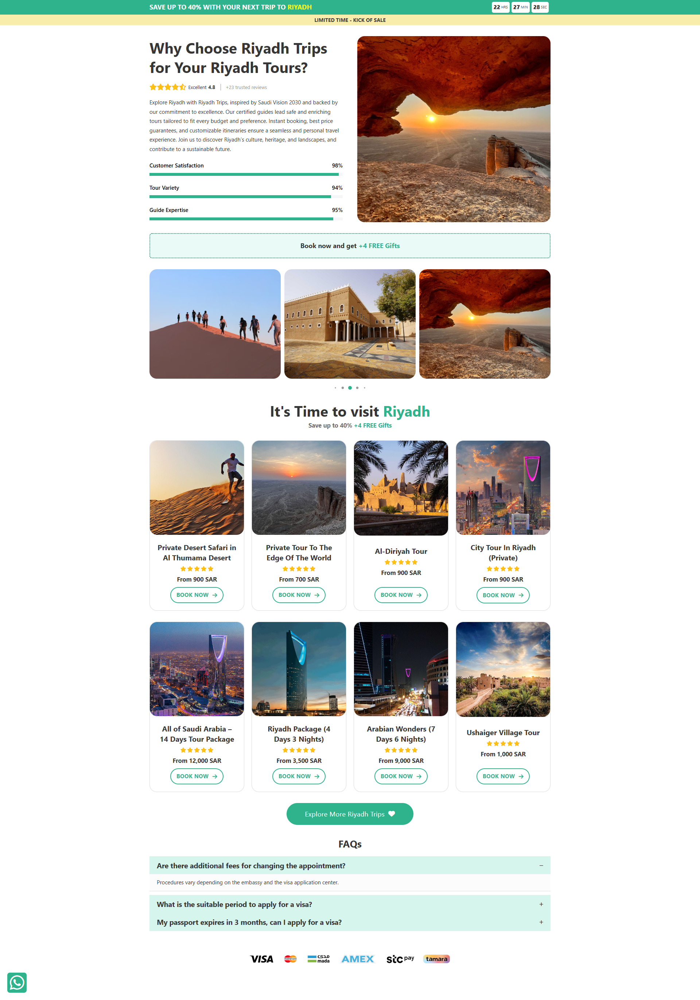

# Travel Landing Page Template With Bricks Builder

A free, customizable travel landing page template designed using Bricks Builder. Perfect for travel agencies looking to enhance their online presence.

## Features
- Easy to use
- Sleek design

## Installation
1. Clone the repo: `git clone https://github.com/ulayers/travel-landing-page-bricks-template.git`
2. Upload to your WordPress, Bricks tepmplates directory.
3. Apply it on any page.

## Preview
Check out a live preview of the template here: [Template Preview](https://riyadh.riyadhtrips.com/)

## License
This project is licensed under the MIT License. Attribution required: "Created by Mohamed Ali."

## Credits
Designed by Mohamed Ali.
Powered by [LAYERS](https://www.ulayers.com/).
